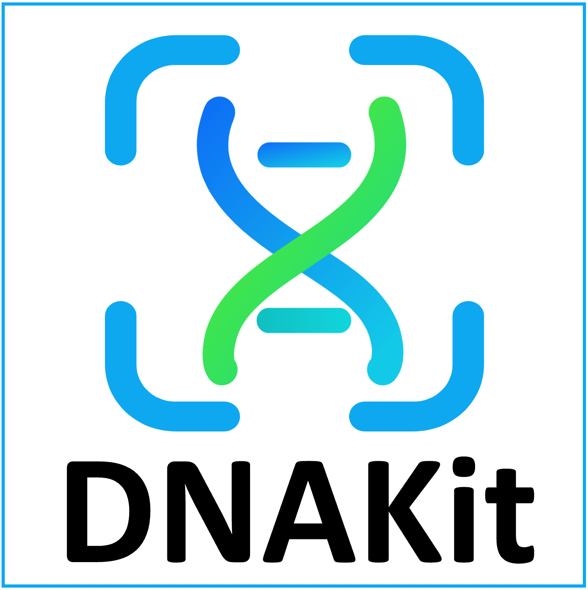

<p align="center">
  
</p>
<p align="center">
  <a href="https://doi.org/10.1038/s41467-025-63688-5">
    
  </a>
</p>

<table align="center">
  <tr>
    <th align="center">Packages (downloads)</th>
    <th align="center" colspan="2">Tutorials</th>
    <th align="center" colspan="2">Models</th>
  </tr>
  <tr>
    <td align="center">
      <a href="https://pypi.org/project/flexynesis/">
        
      </a><br>
      <a href="https://anaconda.org/bioconda/flexynesis">
        
      </a><br>
      <a href="https://hub.docker.com/repository/docker/borauyar/flexynesis/">
        
      </a>
    </td>
    <!-- Tutorials Ubuntu -->
    <td align="center">
      <b>Ubuntu</b><br>
      <br>
      <br>
      <br>
    </td>
    <!-- Tutorials macOS -->
    <td align="center">
      <b>macOS</b><br>
      <br>
      <br>
      <br>
    </td>
    <!-- Models Ubuntu -->
    <td align="center">
      <b>Ubuntu</b><br>
      <br>
      <br>
      <br>
    </td>
    <!-- Models macOS -->
    <td align="center">
      <b>macOS</b><br>
      <br>
      <br>
      <br>
    </td>
  </tr>
</table>

# DNAKit是什么？

DNAKit 是面向 DNA 序列的可复现 Python 工具包，定位类似“DNA 领域的 RDKit”。它覆盖标准化、文件与注释格式、基础操作、描述符、模式扫描、热力学、指纹、相似度、聚类与数据划分、综合评价、分子生物学模拟和可视化，并可选用 DNA 基础模型提取 rep 后进行 k-means 聚类；不集成启动子活性、表达量、TF 结合强度或 CRISPR 编辑效率等任务型深度学习预测模型。

# 安装与快速入门

如果使用 Python，推荐通过 Conda 创建完整环境。在项目根目录执行：

```bash
conda env create -f environment-dev.yml
conda activate dnakit-dev
```

随后可以阅读 [Python 快速入门指南](docs/quickstart.md)。

更详细的依赖、可选后端和安装说明见 [安装文档](docs/installation.md)。

# 文档

完整文档位于 [DNAKit 文档首页](docs/index.md) 和仓库的 [`docs`](docs/) 目录。

所有功能模块可在 [功能树总览](docs/api/features/function_tree.md) 中查看，常见问题见 [FAQ](docs/faq.md)。

# 支持与社区

如果有问题、意见或建议，可以先查看：

- [常见问题](docs/faq.md)
- [贡献指南](CONTRIBUTING.md)

如果发现缺陷或希望增加功能，请按照 [贡献指南](CONTRIBUTING.md) 中的要求记录问题和复现信息。

DNAKit 当前处于本地开发阶段，尚未开放公共讨论区或邮件列表。
