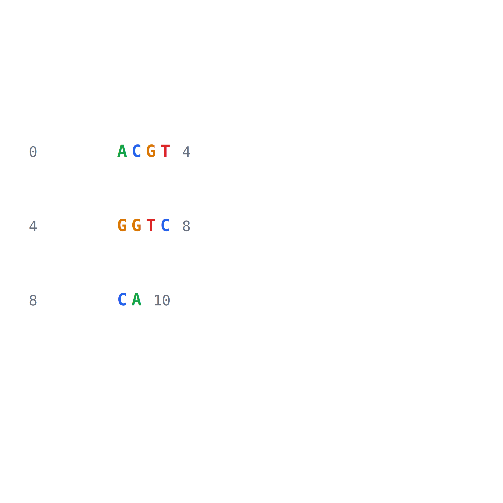
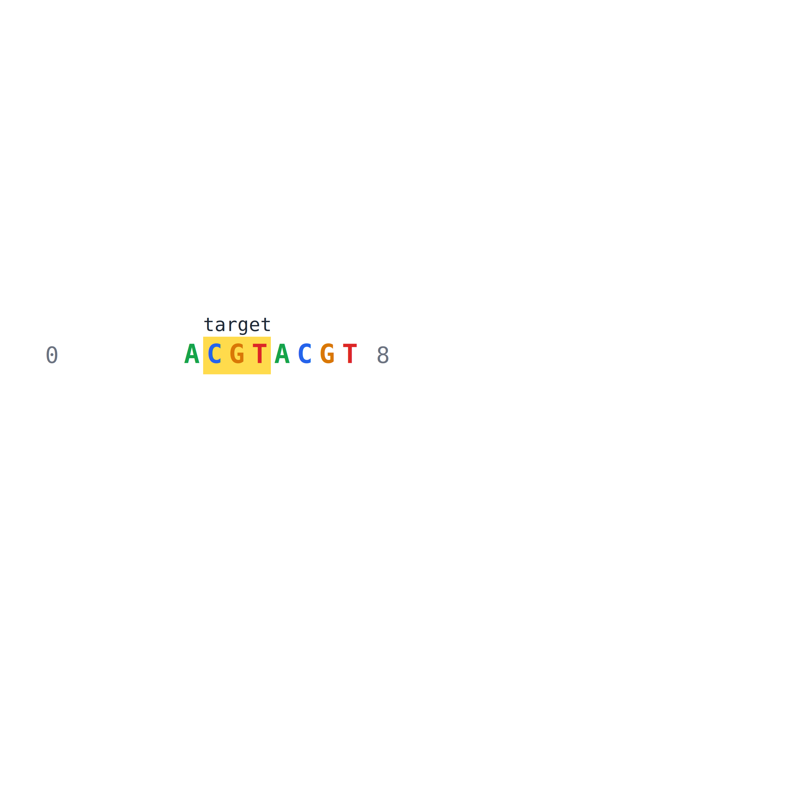
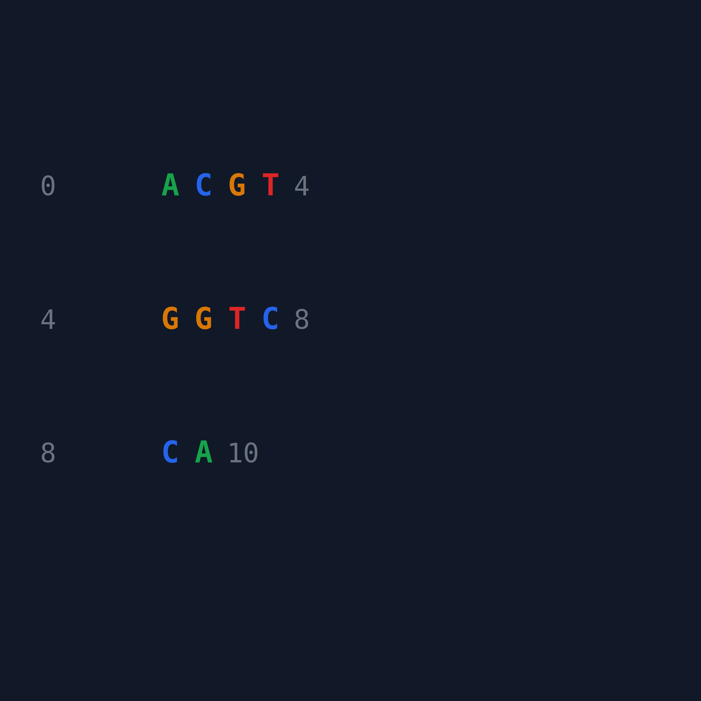
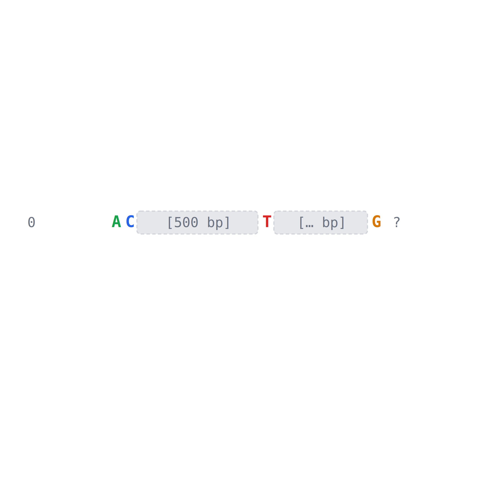
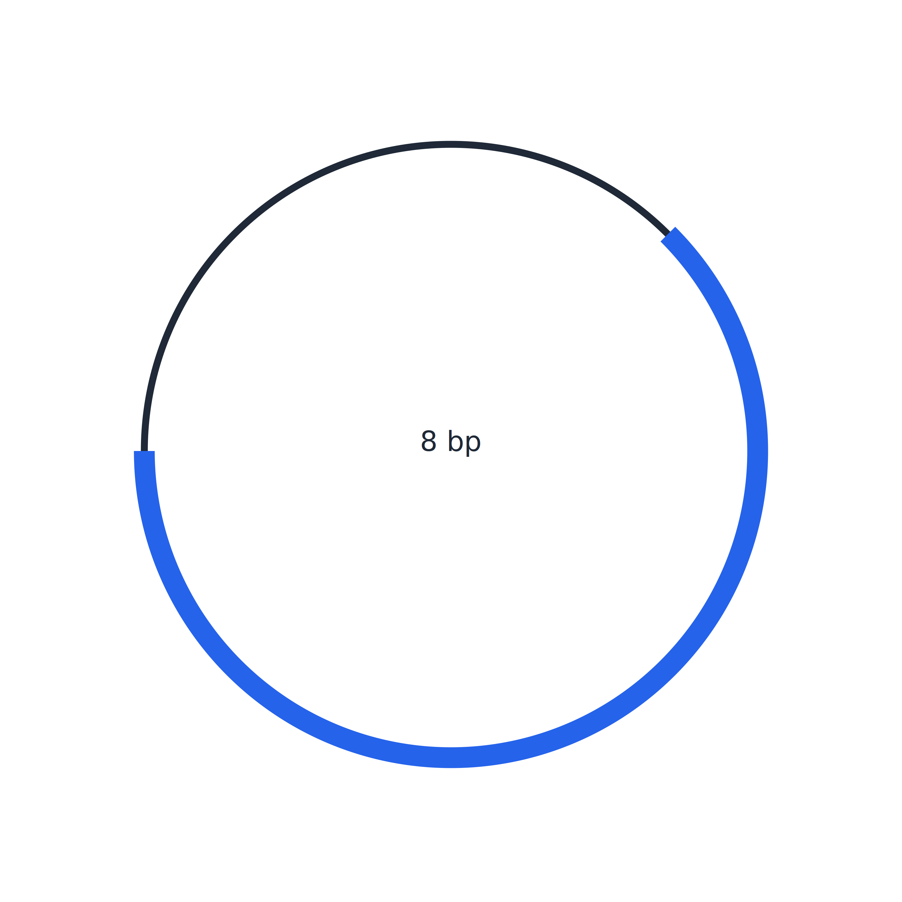
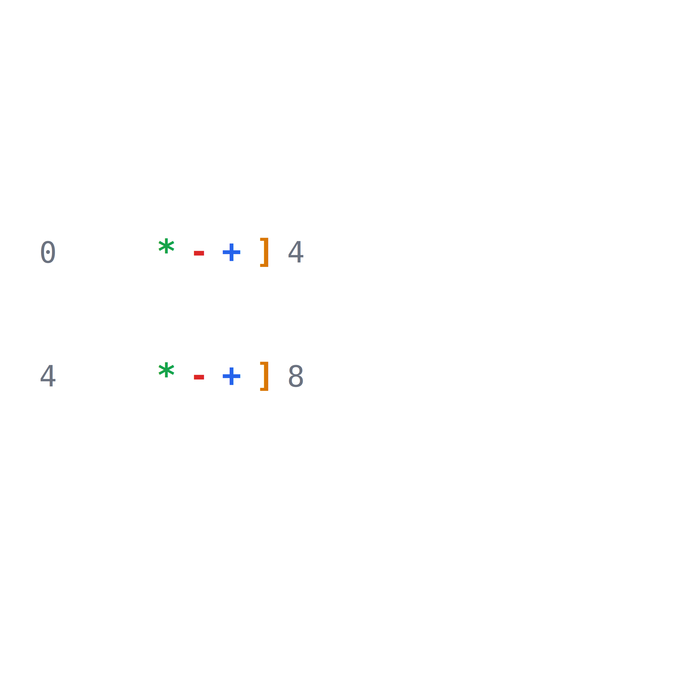
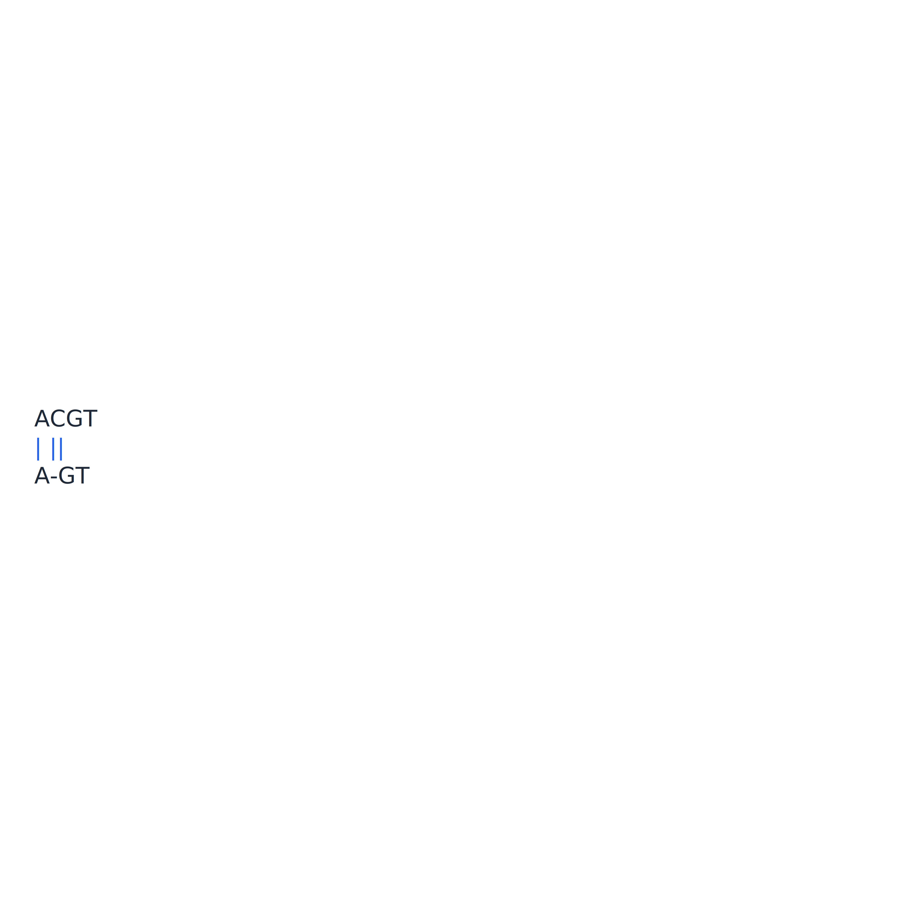

# 可视化

将 DNA 序列、位置、比对和相似度矩阵绘制成可保存的图像。

绘图函数返回确定性的正方形 `SVGArtifact`，图内不显示“DNA sequence”等装饰性标题；坐标、高亮标签、图例和碱基数等数据内容仍会保留。配置中的 `title` 仅用于 SVG 无障碍说明，不会绘制在图内。所有图形统一使用 `save_image()` 导出；`image_type` 可选择 `png`、`svg` 或 `jpg`，默认 `png`，目标路径没有扩展名时会自动补充。SVG 不需要额外图形依赖，PNG/JPG 需要安装 `viz` extra；原有 TIFF/PDF 导出继续兼容。下面每段示例都会把图像保存到当前工作目录，“示例结果”展示的是由相同代码生成的真实图像；保存函数默认拒绝覆盖已有文件。

## 1) `VIZ-001` 序列文字图

- **作用：** 把 DNA 碱基、坐标和可选注释绘制成矢量 SVG，返回可嵌入网页或保存的图形，用于快速查看短序列内容。
- **API**：`dnakit.visualization.plot_sequence(value[必须], highlights[可选], config[可选])`；`config` 使用 `dnakit.visualization.SequencePlotConfig`。
- **输入**：`DNASequence` 或 `DNARecord`；可选每行碱基数、坐标、互补链、行间距、列间距、自定义字符映射和显示上限。
- **导出**：`save_image(artifact, target, image_type[可选])`；可选 `png`、`svg`、`jpg`，默认 `png`。
- **示例代码**：

```python
from dnakit import DNASequence
from dnakit.visualization import SequencePlotConfig, plot_sequence, save_image

artifact = plot_sequence(
    DNASequence("ACGTGGTCCA"),
    config=SequencePlotConfig(bases_per_line=4),
)
save_image(artifact, "viz-001-sequence", image_type="png")
```

- **示例结果（`viz-001-sequence.png`）：**

{ width="420" }

## 2) `VIZ-002` 位置高亮

- **作用**：按坐标、颜色和标签高亮指定碱基或区间，使 motif、突变和其他关注位置在序列图中清晰可见。
- **API**：`dnakit.visualization.Highlight(start[必须], end[必须], label[可选], color[可选], foreground[可选], priority[可选], opacity[可选])`、`dnakit.visualization.plot_sequence(value[必须], highlights[可选], config[可选])`。
- **输入**：序列和高亮区间；可选标签、颜色和优先级。
- **导出**：`save_image(artifact, target, image_type[可选])`；可选 `png`、`svg`、`jpg`，默认 `png`。
- **示例代码**：

```python
from dnakit import DNASequence
from dnakit.visualization import Highlight, plot_sequence, save_image

artifact = plot_sequence(
    DNASequence("ACGTACGT"),
    highlights=[Highlight(1, 4, label="target", color="#ffcc00")],
)
save_image(artifact, "viz-002-highlight", image_type="png")
```

- **示例结果（`viz-002-highlight.png`）：**

{ width="420" }

## 3) `VIZ-003` 样式控制

- **作用**：通过统一样式配置控制颜色、字体、尺寸、边距、行间距、文字列间距和布局，使不同可视化结果具有一致外观并可复现。
- **API**：`dnakit.visualization.SVGTheme(background[可选], foreground[可选], muted[可选], grid[可选], accent[可选], missing[可选], font_family[可选])`；序列文字图使用 `SequencePlotConfig(font_size[可选], cell_width[可选], line_height[可选], column_spacing[可选], line_spacing[可选], margin[可选], theme[可选])`。
- **输入**：绘图配置；`column_spacing` 控制相邻文字列之间增加的水平像素，`line_spacing` 控制相邻序列行之间增加的垂直像素，二者默认均为 `0`。
- **导出**：`save_image(artifact, target, image_type[可选])`；可选 `png`、`svg`、`jpg`，默认 `png`。
- **示例代码**：

```python
from dnakit import DNASequence
from dnakit.visualization import SVGTheme, SequencePlotConfig, plot_sequence, save_image

theme = SVGTheme(background="#111827", foreground="#f9fafb", accent="#22c55e")
artifact = plot_sequence(
    DNASequence("ACGTGGTCCA"),
    config=SequencePlotConfig(
        bases_per_line=4,
        font_size=18,
        column_spacing=8,
        line_spacing=18,
        theme=theme,
    ),
)
save_image(artifact, "viz-003-theme", image_type="png")
```

- **示例结果（`viz-003-theme.png`）：**

{ width="420" }

## 4) `VIZ-004` Gap 显示

- **作用**：在序列图中用专门符号显示 Gap 的位置、已知或未知长度，同时保持坐标含义，避免把缺失区域误画成真实碱基。
- **API**：`dnakit.Gap(length[必须], kind[可选], crossable[可选], evidence[可选], metadata[可选])`、`dnakit.visualization.plot_sequence(value[必须], highlights[可选], config[可选])`。
- **输入**：包含显式 `Gap` part 的 `DNASequence` 或记录。
- **导出**：`save_image(artifact, target, image_type[可选])`；可选 `png`、`svg`、`jpg`，默认 `png`。
- **示例代码**：

```python
from dnakit import DNASequence, Gap
from dnakit.visualization import plot_sequence, save_image

sequence = DNASequence(["AC", Gap(500), "T", Gap(None), "G"])
artifact = plot_sequence(sequence)
save_image(artifact, "viz-004-gap", image_type="png")
```

- **示例结果（`viz-004-gap.png`）：**

{ width="432" }

## 5) `VIZ-005` 线性序列图

- **作用**：沿线性 DNA 坐标绘制 feature 的起止范围、方向和标签，生成类似基因结构图的 SVG，用于查看多个注释的相对位置。
- **API**：`dnakit.visualization.plot_linear_map(value[必须], width[可选], height[可选], max_features[可选], title[可选], theme[可选])`；画布边长取 `width` 和 `height` 中较大的值，`title` 仅作为 SVG 无障碍说明。
- **输入**：resolved linear `DNASequence` 或带 `DNAFeature` 的 `DNARecord`；输出始终为正方形。
- **导出**：`save_image(artifact, target, image_type[可选])`；可选 `png`、`svg`、`jpg`，默认 `png`。
- **示例代码**：

```python
from dnakit import DNAFeature, DNARecord, DNASequence, Interval
from dnakit.visualization import plot_linear_map, save_image

record = DNARecord(
    DNASequence("ACGTACGT"),
    "linear",
    features=[DNAFeature("gene", Interval(1, 6))],
)
artifact = plot_linear_map(record)
save_image(artifact, "viz-005-linear-map", image_type="png")
```

- **示例结果（`viz-005-linear-map.png`）：**

{ width="900" }

## 6) `VIZ-006` 环状 DNA 图

- **作用**：把环状 DNA 及其 feature 映射到圆周坐标，显示方向、跨原点区间和标签，用于质粒或其他环状分子的结构概览。
- **API**：`dnakit.visualization.plot_circular_map(value[必须], size[可选], max_features[可选], title[可选], theme[可选])`；`size` 是正方形画布边长，`title` 仅作为 SVG 无障碍说明。
- **输入**：`topology="circular"` 的 resolved 序列或记录。
- **导出**：`save_image(artifact, target, image_type[可选])`；可选 `png`、`svg`、`jpg`，默认 `png`。
- **示例代码**：

```python
from dnakit import DNAFeature, DNARecord, DNASequence, Interval
from dnakit.visualization import plot_circular_map, save_image

record = DNARecord(
    DNASequence("ACGTACGT", topology="circular"),
    "plasmid",
    features=[DNAFeature("gene", Interval(1, 6))],
)
artifact = plot_circular_map(record)
save_image(artifact, "viz-006-circular-map", image_type="png")
```

- **示例结果（`viz-006-circular-map.png`）：**

{ width="520" }

## 7) `VIZ-007` 自定义字符表示

- **作用**：把 A、T、C、G 或 IUPAC 符号替换为调用方指定的显示字符，例如 A 显示为 `*`、T 显示为 `-`、C 显示为 `+`、G 显示为 `]`；坐标、高亮、互补关系和碱基颜色仍按原始序列计算。
- **API**：`dnakit.visualization.SequencePlotConfig(symbol_map[可选])`；通过 `plot_sequence(value, config=config)` 使用。
- **输入**：`symbol_map` 的键是大写 DNA/IUPAC 符号，值是一个可见字符；未配置的符号保持原样，默认映射为空。
- **导出**：`save_image(artifact, target, image_type[可选])`；可选 `png`、`svg`、`jpg`，默认 `png`。
- **示例代码**：

```python
from dnakit import DNASequence
from dnakit.visualization import SequencePlotConfig, plot_sequence, save_image

artifact = plot_sequence(
    DNASequence("ATCGATCG"),
    config=SequencePlotConfig(
        bases_per_line=4,
        font_size=20,
        column_spacing=8,
        line_spacing=14,
        symbol_map={"A": "*", "T": "-", "C": "+", "G": "]"},
    ),
)
save_image(artifact, "viz-007-custom-symbols", image_type="png")
```

- **示例结果（`viz-007-custom-symbols.png`）：**

{ width="420" }

## 8) `VIZ-008` Alignment 图

- **作用**：将成对比对的两条序列按列绘制，区分匹配、错配、插入和删除，并显示坐标，便于人工检查差异位置。
- **API**：`dnakit.visualization.plot_alignment(result[必须], columns_per_line[可选], max_columns[可选], theme[可选])`。
- **输入**：预先计算的 `AlignmentResult`；可选每行列数和上限，输出始终为正方形。
- **导出**：`save_image(artifact, target, image_type[可选])`；可选 `png`、`svg`、`jpg`，默认 `png`。
- **示例代码**：

```python
from dnakit import DNASequence
from dnakit.alignment import align_pairwise
from dnakit.visualization import plot_alignment, save_image

alignment = align_pairwise(DNASequence("ACGT"), DNASequence("AGT"))
artifact = plot_alignment(alignment, columns_per_line=4)
save_image(artifact, "viz-008-alignment", image_type="png")
```

- **示例结果（`viz-008-alignment.png`）：**

{ width="640" }
